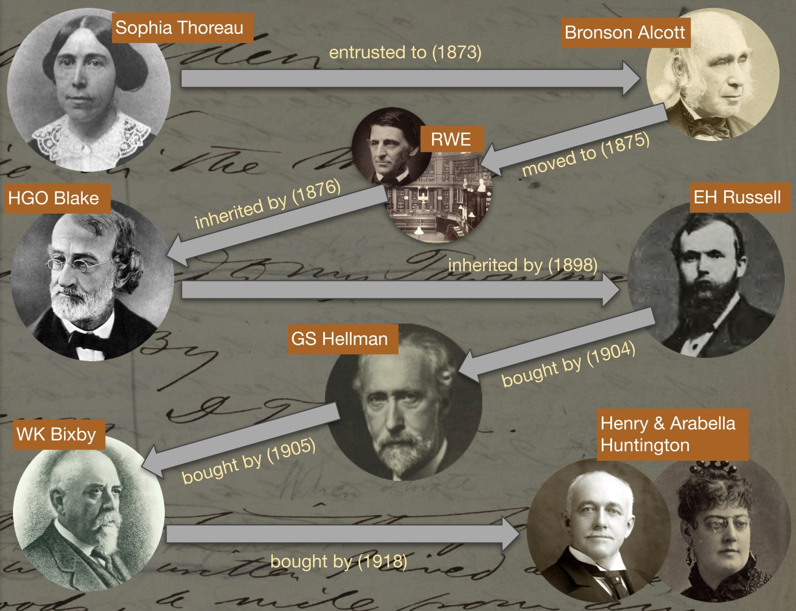
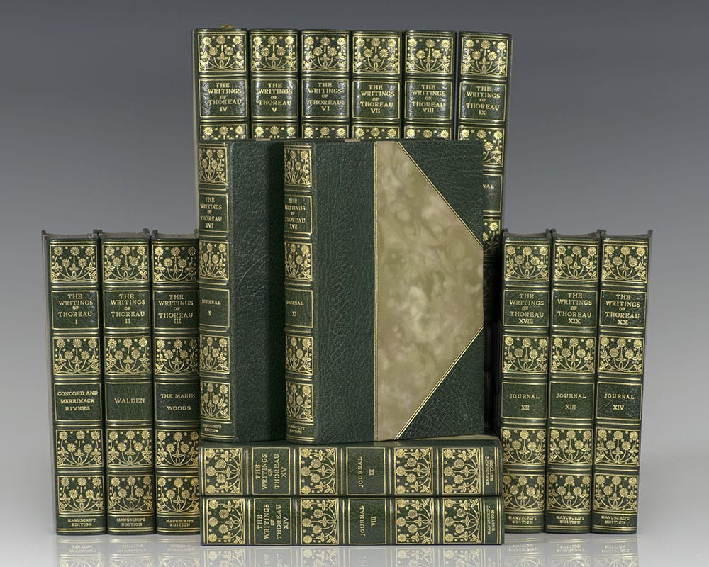
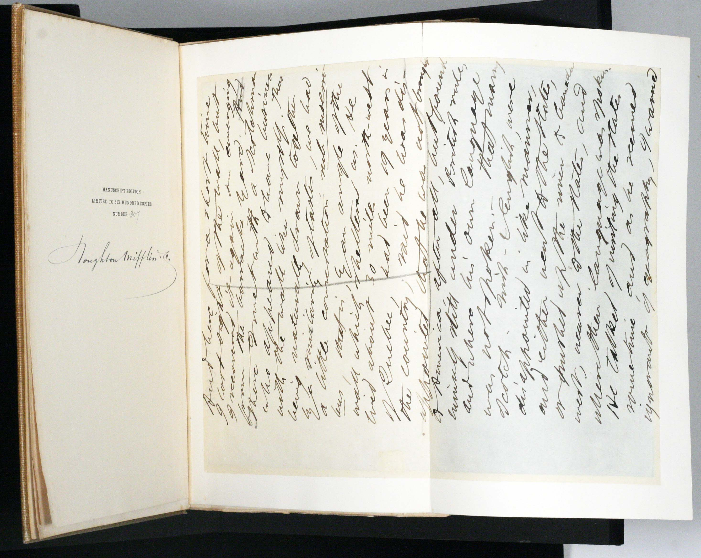

Briefly, all of Thoreau’s manuscripts were inherited by his sister Sophia in Concord, who entrusted them to Bronson Alcott when she moved to Maine in 1873. That was probably the last time they were in the order Thoreau left them in. When she learned that Alcott had allowed Thoreau admirer Franklin Benjamin Sanborn to handle and even borrow manuscript items, Sophia asked Alcott to deposit Thoreau’s manuscripts in the town library (now the Concord Free Public Library) with Ralph Waldo Emerson as trustee. 

On Sophia’s death in 1876 all but Thoreau’s surveys and surveying field notes went, at Sophia’s request, to Thoreau disciple, friend, and correspondent Harrison Gray Otis Blake. Blake held Thoreau’s manuscripts until his death in 1898, and during that time gave some manuscript fragments away. 

In his later years, Blake was taken care of by Worcester school teacher and educational reformer Elias Harlow Russell. Russell inherited the manuscripts from Blake. He then sold several hundred loose manuscript leaves, and the publishing rights to Thoreau’s Journal, to the publisher Houghton Mifflin before selling all but the Journal manuscripts to NY dealer George Sidney Hellman in 1904. 

Hellman re-arranged the manuscripts from whatever was left of their original order, sold perhaps 400 miscellaneous leaves to NY collector William Augustus White, then sold everything else, including the Walden manuscript, to St. Louis book dealer William Keeney Bixby in 1905. Bixby in turn sold the Walden manuscript to Henry E. and Arabella Huntington in 1918, a year before the founding of the Huntington Library in 1919.

At what subsequently became the Huntington Library, Art Museum, and Botanical Gardens, the manuscript of *Walden* is identified as HM 924. 

But HM 924 is not the whole of the Walden manuscript. Those miscellaneous leaves that were sold to Houghton Mifflin included some leaves of the *Walden* manuscript. Houghton Mifflin used the leaves they’d purchased to tip them into the 600 sets of its limited “Manuscript Edition” of 1906, and some of the tipped-in leaves were leaves of Walden.

Over the years, about 50 leaves of Walden have surfaced that are not in HM 924, either because they wound up in Manuscript Edition sets or because they were among some of the other leaves that were sold before the manuscript came to the Huntington. Some of the Walden leaves tipped into Manuscript Edition sets have remained in those sets, but others have been removed and sold separately. There are perhaps 17 libraries and and a number of private collectors who own Walden leaves not in HM 924. 

